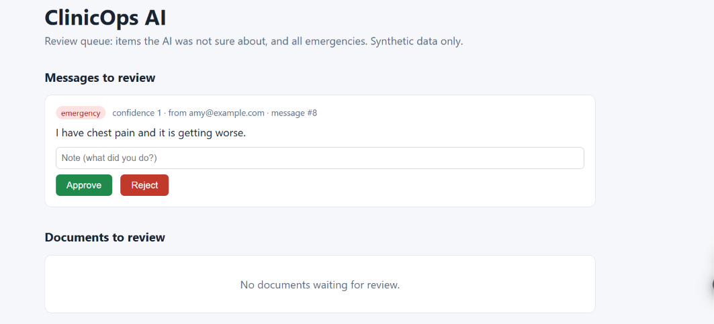

# ClinicOps AI

An AI assistant that removes administrative work for small clinics: it sorts incoming messages, proposes appointment slots, extracts data from insurance documents, and sends anything uncertain to a human. It does not diagnose or give medical advice.

**Uses synthetic data only. Not HIPAA-compliant. Do not use with real patient data.**

## Screenshot

Review queue (synthetic data):



Open it at `/ui` while the server is running.

## What it does

- **AI inbox:** classifies messages (appointment, billing, insurance, referral, prescription, question, emergency)
- **Scheduling agent:** reads "Thursday afternoon", proposes slots, books and reschedules, prevents double-booking
- **Document extraction:** reads a PDF and extracts patient, insurer, policy number, referral date, doctor
- **Human-in-the-loop:** emergencies, low-confidence results, unclear scheduling requests, incomplete documents and AI errors go to a review queue with approve / reject
- **Audit trail:** every action is logged with actor (ai / system / human) and timestamp

## Flow

```
Message / PDF -> AI (Gemini, structured output) -> confident?
    yes -> action (classify / propose slots / save fields)
    no  -> human review queue -> approve / reject
Every step -> audit log
```

## Tech stack


Python, FastAPI, SQLAlchemy, SQLite, Gemini API (free tier), pytest, plain HTML review page

## Run locally

```bash
cd backend
python -m venv venv
venv\Scripts\activate        # Windows
pip install -r requirements.txt
```

Create a `.env` file in the project root:

```
GEMINI_API_KEY=your_key_here
GEMINI_MODEL=gemini-3.5-flash-lite
```

Google retires models often, so check the current free model name in Google AI Studio.

Start the server from the `backend` folder:

```bash
uvicorn app.main:app --reload
```

- API docs: http://127.0.0.1:8000/docs
- Review page: http://127.0.0.1:8000/ui

## Tests


8 automated tests cover slot finding, booking, double-booking, past and out-of-hours bookings, and rescheduling. They use an in-memory database and make no AI calls.

```bash
cd backend
python -m pytest tests -v
```

## Evaluation

### Standard set (28 messages)

Classifier tested on 28 synthetic messages (4 per category, 7 categories) using `gemini-3.5-flash-lite`:

- Accuracy: 28/28
- Emergencies: 4/4 correctly classified and routed to human review
- Caveat: small, clean, synthetic set. Real messages will be messier.

Run it yourself: `cd backend && python eval_classifier.py` (results are cached, so it resumes after a quota stop).

### Harder set (15 messages: typos, two requests in one, vague wording)

- Accuracy: 14/15
- Emergencies: 3/3 caught and routed to a human
- The one miss was over-escalation: "I feel a bit dizzy since this morning" was classified as emergency instead of patient question. The system errs on the side of human review for symptoms, which is the intended safety behavior.
- Still small and synthetic, so treat these as a sanity check, not an accuracy guarantee.

Run it yourself: `cd backend && python eval_hard.py`

Note: free-tier API limits are tight (about 20 requests/day on one model when tested), so API errors are treated as "send to human review" rather than guessed.

## Limitations


- No login yet: anyone with access to the server can use the review page
- Messages arrive through the API only (no email, SMS or voice yet)
- SQLite database, single clinic, no real calendar integration
- Not a full tool-calling agent: the code decides the next step, the AI classifies, extracts and parses

## Roadmap

- Password protection and a request limit (needed before going public)
- Free deployment (Render)
- Email inbox integration
- Tool-calling agent that chooses its own actions
- Postgres, Docker, GitHub Actions CI